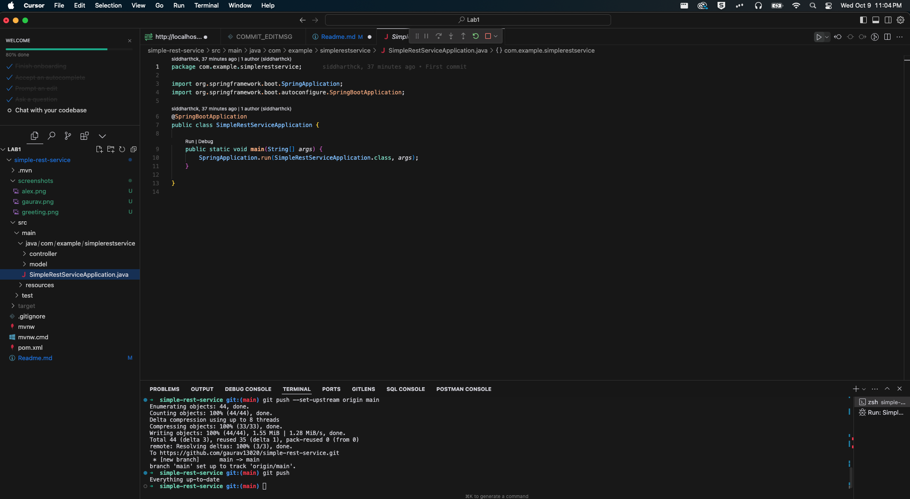
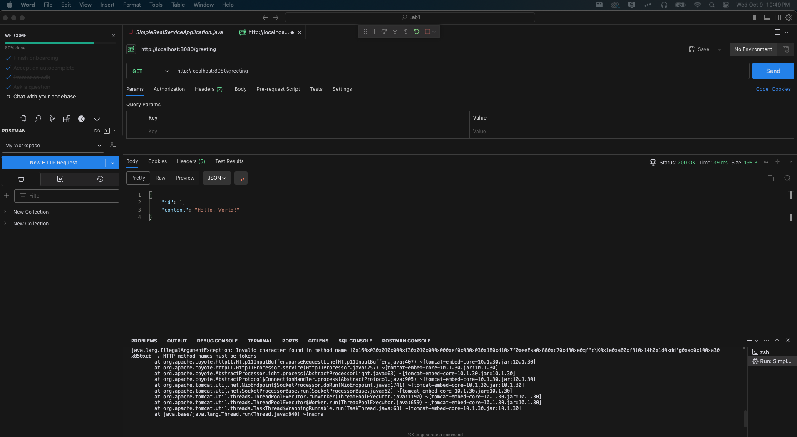
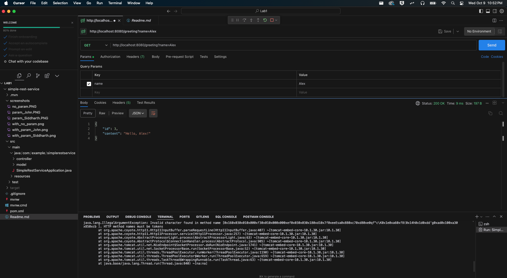
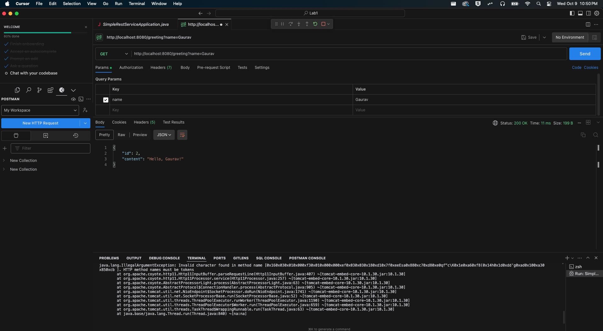

# Simple Rest Service Application using Java Spring Boot


## How to Run the Application
Click on the `Run` button in the IDE in the top right corner of SimpleRestServiceApplication.java file to run the application.



By default, the application will start on port `8080`.

## How to Test the API

Once the application is running, you can use Postman or cURL to make GET requests to the following endpoint:

- **Without query parameter:**
  ```
  http://localhost:8080/greeting
  ```

- **With query parameter (`name`):**
  ```
  http://localhost:8080/greeting?name=YourName
  ```

This will return a greeting message from the application.

## Screenshots
### With no query parameter



### With query parameter Alex



### With query parameter Gaurav


